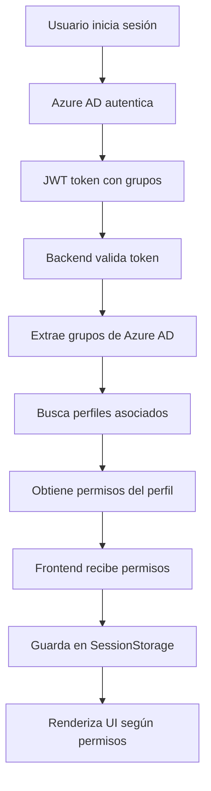

# 🔐 Sistema de Autorización con Azure AD y Perfiles

## 📋 Descripción del Sistema

Este proyecto implementa un sistema completo de autorización basado en **Azure Active Directory (Azure AD)** que permite gestionar usuarios, grupos, perfiles y permisos de forma granular. El sistema está completamente en **español** y utiliza las mejores prácticas de seguridad.

## 🏗️ Arquitectura del Sistema

### **Frontend (Angular)**
- **Framework**: Angular con TypeScript
- **Autenticación**: Microsoft Authentication Library (MSAL)
- **Gestión de Estado**: RxJS y BehaviorSubjects
- **Almacenamiento**: SessionStorage para permisos
- **UI**: Componentes reactivos con directivas personalizadas

### **Backend (Spring Boot)**
- **Framework**: Spring Boot con Spring Security
- **Autenticación**: JWT tokens de Azure AD
- **Base de Datos**: H2 (desarrollo) / PostgreSQL (producción)
- **ORM**: JPA/Hibernate
- **API**: REST con documentación automática

## 🔄 Flujo de Autorización



## 📊 Modelo de Base de Datos

### **Entidades Principales**

#### 🧑‍💼 **Usuarios**
```sql
usuarios (
    id BIGINT PRIMARY KEY,
    nombre VARCHAR(50),
    email VARCHAR(100) UNIQUE,
    azure_object_id VARCHAR(100),
    departamento VARCHAR(50),
    cargo VARCHAR(50),
    activo BOOLEAN,
    fecha_creacion TIMESTAMP,
    fecha_actualizacion TIMESTAMP
)
```

#### 👥 **Perfiles** (Asociados a grupos de Azure AD)
```sql
perfiles (
    id BIGINT PRIMARY KEY,
    nombre VARCHAR(50) UNIQUE,
    descripcion VARCHAR(255),
    azure_group_id VARCHAR(100),    -- ID del grupo en Azure AD
    azure_group_name VARCHAR(100),  -- Nombre del grupo en Azure AD
    activo BOOLEAN,
    fecha_creacion TIMESTAMP,
    fecha_actualizacion TIMESTAMP
)
```

#### 🔑 **Permisos**
```sql
permisos (
    id BIGINT PRIMARY KEY,
    codigo VARCHAR(50) UNIQUE,      -- Ej: "USUARIOS_LEER"
    nombre VARCHAR(100),            -- Ej: "Ver Usuarios"
    descripcion VARCHAR(255),
    modulo VARCHAR(50),             -- Ej: "USUARIOS"
    accion VARCHAR(20),             -- Ej: "LEER"
    activo BOOLEAN,
    fecha_creacion TIMESTAMP,
    fecha_actualizacion TIMESTAMP
)
```

#### 🔗 **Relación Perfil-Permisos** (Muchos a Muchos)
```sql
perfil_permisos (
    perfil_id BIGINT,
    permiso_id BIGINT,
    PRIMARY KEY (perfil_id, permiso_id)
)
```

## 🎯 Permisos del Sistema

### **Módulos y Acciones Disponibles**

| Módulo | Permisos | Descripción |
|--------|----------|-------------|
| **USUARIOS** | `USUARIOS_LEER`<br>`USUARIOS_CREAR`<br>`USUARIOS_EDITAR`<br>`USUARIOS_ELIMINAR` | Gestión completa de usuarios |
| **REPORTES** | `REPORTES_LEER`<br>`REPORTES_CREAR`<br>`REPORTES_EXPORTAR` | Sistema de reportes |
| **CONFIGURACION** | `CONFIG_LEER`<br>`CONFIG_EDITAR` | Configuración del sistema |
| **PERFILES** | `PERFILES_LEER`<br>`PERFILES_CREAR`<br>`PERFILES_EDITAR`<br>`PERFILES_ELIMINAR` | Gestión de perfiles y roles |
| **DASHBOARD** | `DASHBOARD_LEER`<br>`DASHBOARD_ADMIN` | Acceso a dashboards |

### **Perfiles Predefinidos**

#### 🔴 **Administrador**
- **Grupo Azure AD**: `admin-group-id-123`
- **Permisos**: TODOS los permisos del sistema
- **Descripción**: Acceso completo al sistema

#### 🟡 **Gestor**
- **Grupo Azure AD**: `manager-group-id-456`
- **Permisos**: Gestión de usuarios, reportes, configuración (solo lectura)
- **Descripción**: Acceso de gestión con permisos limitados

#### 🟢 **Usuario**
- **Grupo Azure AD**: `user-group-id-789`
- **Permisos**: Lectura de usuarios, reportes, configuración y dashboard
- **Descripción**: Usuario estándar con permisos básicos

#### 🔵 **Lector**
- **Grupo Azure AD**: `reader-group-id-101`
- **Permisos**: Solo permisos de lectura
- **Descripción**: Acceso de solo lectura

## 🚀 Endpoints del Backend

### **Autorización** (`/api/autorizacion`)

| Método | Endpoint | Descripción |
|--------|----------|-------------|
| `GET` | `/informacion-usuario` | Información completa del usuario con permisos |
| `GET` | `/permisos` | Lista de permisos del usuario |
| `GET` | `/codigos-permisos` | Códigos de permisos del usuario |
| `GET` | `/tiene-permiso/{codigo}` | Verifica un permiso específico |
| `POST` | `/verificar-permisos` | Verifica múltiples permisos |
| `GET` | `/tiene-permiso-modulo/{modulo}` | Verifica permisos por módulo |
| `GET` | `/tiene-permiso-accion/{accion}` | Verifica permisos por acción |
| `POST` | `/validar-acceso` | Validación compleja de acceso |

### **Perfiles** (`/api/perfiles`)

| Método | Endpoint | Descripción |
|--------|----------|-------------|
| `GET` | `/` | Obtener todos los perfiles |
| `GET` | `/con-permisos` | Perfiles con permisos cargados |
| `GET` | `/{id}` | Obtener perfil por ID |
| `GET` | `/azure-group/{groupId}` | Perfil por grupo de Azure AD |
| `POST` | `/` | Crear nuevo perfil |
| `PUT` | `/{id}` | Actualizar perfil |
| `DELETE` | `/{id}` | Eliminar perfil |

### **Permisos** (`/api/permisos`)

| Método | Endpoint | Descripción |
|--------|----------|-------------|
| `GET` | `/` | Obtener todos los permisos |
| `GET` | `/{id}` | Obtener permiso por ID |
| `GET` | `/codigo/{codigo}` | Obtener permiso por código |
| `GET` | `/modulo/{modulo}` | Permisos por módulo |
| `GET` | `/modulos` | Lista de módulos |
| `POST` | `/` | Crear nuevo permiso |
| `PUT` | `/{id}` | Actualizar permiso |

## 🎨 Componentes del Frontend

### **Componentes Principales**

#### 🏠 **AppComponent**
- Navegación principal con permisos
- Estado de autenticación
- Inicialización de permisos
- Menús dinámicos según rol

#### 👤 **UserPermissionsComponent**
- Dashboard de permisos del usuario
- Información de perfiles asignados
- Ejemplos de renderizado condicional
- Estadísticas de permisos

#### 🚫 **AccessDeniedComponent**
- Página de acceso denegado
- Información del usuario actual
- Opciones de navegación
- Actualización de permisos

### **Directivas Personalizadas**

#### `*hasPermission`
```html
<!-- Mostrar si tiene permiso específico -->
<button *hasPermission="'USUARIOS_CREAR'">Crear Usuario</button>

<!-- Mostrar si tiene alguno de los permisos -->
<div *hasPermission="['USUARIOS_LEER', 'USUARIOS_EDITAR']; requireAll: false">
  Lista de usuarios
</div>

<!-- Mostrar si tiene permisos para un módulo -->
<nav *hasPermission="null; module: 'REPORTES'">
  Menú de reportes
</nav>
```

#### `*isAdmin` y `*isManager`
```html
<!-- Solo para administradores -->
<div *isAdmin>
  <p>Contenido exclusivo para administradores</p>
</div>

<!-- Solo para gestores -->
<div *isManager>
  <p>Contenido para gestores</p>
</div>
```

### **Guards de Rutas**

#### **PermissionGuard**
```typescript
{
  path: 'usuarios',
  component: UsuariosComponent,
  canActivate: [PermissionGuard],
  data: { 
    permissions: ['USUARIOS_LEER'],
    requireAll: false
  }
}
```

#### **AdminGuard** y **ManagerGuard**
```typescript
{
  path: 'admin',
  component: AdminComponent,
  canActivate: [AdminGuard]
}
```

## 🛠️ Configuración e Instalación

### **Requisitos Previos**
- Node.js 18+
- Java 17+
- Maven 3.8+
- Cuenta de Azure AD

### **Configuración de Azure AD**

1. **Crear App Registration en Azure Portal**
2. **Configurar grupos de seguridad**
3. **Asignar usuarios a grupos**
4. **Configurar permisos de API**

### **Instalación del Backend**

```bash
cd spring-api-entra
mvn clean install
mvn spring-boot:run
```

### **Instalación del Frontend**

```bash
npm install
ng serve
```

## 🔧 Configuración de Grupos de Azure AD

### **Mapeo de Grupos a Perfiles**

En la base de datos, cada perfil debe tener configurado el `azure_group_id` correspondiente:

```sql
-- Ejemplo de configuración
UPDATE perfiles SET azure_group_id = 'real-admin-group-id' WHERE nombre = 'Administrador';
UPDATE perfiles SET azure_group_id = 'real-manager-group-id' WHERE nombre = 'Gestor';
UPDATE perfiles SET azure_group_id = 'real-user-group-id' WHERE nombre = 'Usuario';
```

### **Configuración en Azure Portal**

1. **Grupos de Seguridad**:
   - Crear grupos: `Administradores`, `Gestores`, `Usuarios`, `Lectores`
   - Asignar usuarios a grupos apropiados

2. **Token Configuration**:
   - Habilitar "groups" claim en el token
   - Configurar Group ID en lugar de Group Name

## 📱 Uso del Sistema

### **Para Usuarios**
1. Ingresar a la aplicación
2. Iniciar sesión con Azure AD
3. El sistema automáticamente carga permisos
4. Navegar según permisos disponibles

### **Para Administradores**
1. Gestionar perfiles en la base de datos
2. Asignar permisos a perfiles
3. Configurar grupos en Azure AD
4. Monitorear accesos y permisos

## 🔍 Debugging y Logs

### **Frontend**
```javascript
// Ver permisos en consola
console.log('Permisos del usuario:', authService.getCurrentPermissions());

// Ver información completa
console.log('Info del usuario:', authService.getCurrentUserInfo());
```

### **Backend**
```java
// Logs automáticos en consola
// Verificar grupos de Azure AD extraídos
// Validar mapeo de perfiles
```

## 🚀 Extensión del Sistema

### **Agregar Nuevos Permisos**
1. Insertar en tabla `permisos`
2. Asignar a perfiles apropiados
3. Usar en frontend con directivas

### **Crear Nuevos Perfiles**
1. Insertar en tabla `perfiles`
2. Configurar `azure_group_id`
3. Asignar permisos necesarios

### **Nuevos Módulos**
1. Definir permisos del módulo
2. Crear componentes con guards
3. Configurar rutas protegidas

## 📈 Mejores Prácticas

### **Seguridad**
- ✅ Validación en frontend Y backend
- ✅ Tokens JWT seguros
- ✅ Principio de menor privilegio
- ✅ Auditoría de accesos

### **Rendimiento**
- ✅ Caché de permisos en SessionStorage
- ✅ Lazy loading de módulos
- ✅ Optimización de consultas

### **Mantenibilidad**
- ✅ Código documentado en español
- ✅ Separación de responsabilidades
- ✅ Patrones de diseño consistentes
- ✅ Testing automatizado

## 🤝 Contribución

Para contribuir al proyecto:
1. Fork del repositorio
2. Crear rama de feature
3. Implementar cambios
4. Crear Pull Request

## 📄 Licencia

Este proyecto está bajo la licencia MIT.

---

**¡Sistema completo de autorización listo para producción! 🎉**
