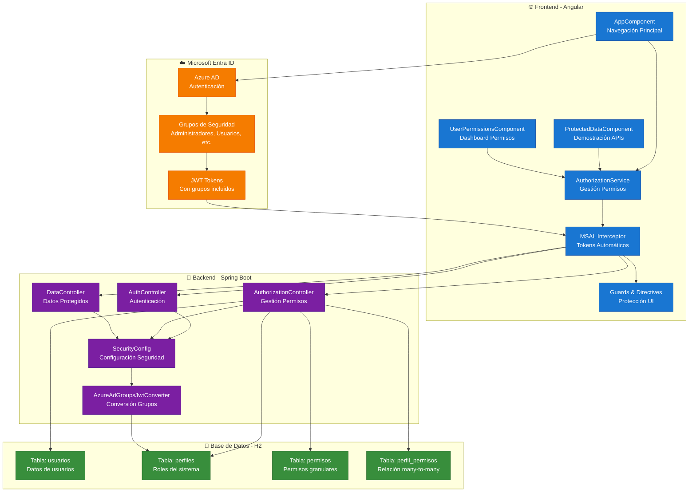

# 🏗️ Arquitectura del Sistema - Angular + Spring Boot + Azure AD

## Diagrama de Arquitectura General

## Componentes por Capa

### 🌐 **Frontend (Angular)**
- **AppComponent**: Navegación principal y estado de autenticación
- **ProtectedDataComponent**: Demostración de APIs protegidas
- **UserPermissionsComponent**: Dashboard de permisos del usuario
- **AuthorizationService**: Gestión centralizada de permisos
- **MSAL Interceptor**: Agrega tokens automáticamente a peticiones HTTP
- **Guards & Directives**: Protección de rutas y renderizado condicional

### ☁️ **Microsoft Entra ID**
- **Azure AD**: Servicio de autenticación de Microsoft
- **Grupos de Seguridad**: Administradores, Usuarios, Gestores, etc.
- **JWT Tokens**: Contienen información del usuario y grupos

### 🚀 **Backend (Spring Boot)**
- **AuthController**: Endpoints de autenticación
- **AuthorizationController**: Gestión de permisos y perfiles
- **DataController**: Endpoints de datos protegidos
- **SecurityConfig**: Configuración de seguridad
- **AzureAdGroupsJwtConverter**: Convierte grupos de Azure AD a roles

### 💾 **Base de Datos (H2)**
- **usuarios**: Información de usuarios del sistema
- **perfiles**: Roles/perfiles asociados a grupos de Azure AD
- **permisos**: Permisos granulares del sistema
- **perfil_permisos**: Relación many-to-many entre perfiles y permisos

## Flujo de Datos

1. **Usuario** se autentica en Azure AD
2. **Azure AD** retorna JWT con grupos
3. **Angular** envía token a Spring Boot
4. **Spring Boot** valida token y extrae grupos
5. **Base de Datos** busca perfiles por grupos
6. **Base de Datos** retorna permisos asociados
7. **Angular** recibe permisos y actualiza UI
