# 💾 Base de Datos - Modelo de Datos

## Diagrama Entidad-Relación


## Estructura de Tablas

### **Tabla: usuarios**
```sql
CREATE TABLE usuarios (
    id BIGINT PRIMARY KEY AUTO_INCREMENT,
    nombre VARCHAR(50) NOT NULL,
    email VARCHAR(100) UNIQUE NOT NULL,
    azure_object_id VARCHAR(100),
    departamento VARCHAR(50),
    cargo VARCHAR(50),
    activo BOOLEAN DEFAULT true,
    fecha_creacion TIMESTAMP DEFAULT CURRENT_TIMESTAMP,
    fecha_actualizacion TIMESTAMP DEFAULT CURRENT_TIMESTAMP ON UPDATE CURRENT_TIMESTAMP
);
```

### **Tabla: perfiles**
```sql
CREATE TABLE perfiles (
    id BIGINT PRIMARY KEY AUTO_INCREMENT,
    nombre VARCHAR(50) UNIQUE NOT NULL,
    descripcion VARCHAR(255),
    azure_group_id VARCHAR(100) NOT NULL,
    azure_group_name VARCHAR(100),
    activo BOOLEAN DEFAULT true,
    fecha_creacion TIMESTAMP DEFAULT CURRENT_TIMESTAMP,
    fecha_actualizacion TIMESTAMP DEFAULT CURRENT_TIMESTAMP ON UPDATE CURRENT_TIMESTAMP
);
```

### **Tabla: permisos**
```sql
CREATE TABLE permisos (
    id BIGINT PRIMARY KEY AUTO_INCREMENT,
    codigo VARCHAR(50) UNIQUE NOT NULL,
    nombre VARCHAR(100) NOT NULL,
    descripcion VARCHAR(255),
    modulo VARCHAR(50) NOT NULL,
    accion VARCHAR(20) NOT NULL,
    activo BOOLEAN DEFAULT true,
    fecha_creacion TIMESTAMP DEFAULT CURRENT_TIMESTAMP,
    fecha_actualizacion TIMESTAMP DEFAULT CURRENT_TIMESTAMP ON UPDATE CURRENT_TIMESTAMP
);
```

### **Tabla: perfil_permisos (Relación Many-to-Many)**
```sql
CREATE TABLE perfil_permisos (
    perfil_id BIGINT NOT NULL,
    permiso_id BIGINT NOT NULL,
    PRIMARY KEY (perfil_id, permiso_id),
    FOREIGN KEY (perfil_id) REFERENCES perfiles(id) ON DELETE CASCADE,
    FOREIGN KEY (permiso_id) REFERENCES permisos(id) ON DELETE CASCADE
);
```

## Datos de Ejemplo

### **Permisos del Sistema**


### **Perfiles y sus Permisos**

```mermaid
graph TD
    subgraph "🔴 Administrador"
        A1[Todos los permisos<br/>15 permisos totales]
    end

    subgraph "🟡 Gestor"
        G1[USUARIOS: LEER, CREAR, EDITAR<br/>REPORTES: LEER, CREAR, EXPORTAR<br/>CONFIG: LEER<br/>DASHBOARD: LEER<br/>9 permisos totales]
    end

    subgraph "🟢 Usuario"
        U1[USUARIOS: LEER<br/>REPORTES: LEER<br/>CONFIG: LEER<br/>DASHBOARD: LEER<br/>4 permisos totales]
    end

    subgraph "🔵 Lector"
        L1[USUARIOS: LEER<br/>REPORTES: LEER<br/>CONFIG: LEER<br/>DASHBOARD: LEER<br/>4 permisos totales]
    end

    subgraph "⚪ Usuario Básico"
        B1[USUARIOS: LEER<br/>REPORTES: LEER<br/>CONFIG: LEER<br/>PERFILES: LEER<br/>DASHBOARD: LEER<br/>5 permisos totales]
    end

    %% Estilos para perfiles
    classDef admin fill:#d32f2f,stroke:#b71c1c,color:#ffffff
    classDef gestor fill:#f57c00,stroke:#e65100,color:#ffffff
    classDef usuario fill:#388e3c,stroke:#1b5e20,color:#ffffff
    classDef lector fill:#1976d2,stroke:#0d47a1,color:#ffffff
    classDef basico fill:#7b1fa2,stroke:#4a148c,color:#ffffff

    class A1 admin
    class G1 gestor
    class U1 usuario
    class L1 lector
    class B1 basico
```


## Flujo de Consultas

### **1. Obtener Perfil por Grupo de Azure AD**
```sql
SELECT p.* 
FROM perfiles p 
WHERE p.azure_group_id = 'bdff3193-e802-41d9-a5c6-edc6fb0db732'
  AND p.activo = true;
```

### **2. Obtener Permisos de un Perfil**
```sql
SELECT perm.* 
FROM permisos perm
JOIN perfil_permisos pp ON perm.id = pp.permiso_id
JOIN perfiles p ON pp.perfil_id = p.id
WHERE p.id = 1 
  AND perm.activo = true
  AND p.activo = true;
```

### **3. Verificar Permiso Específico**
```sql
SELECT COUNT(*) > 0 as tiene_permiso
FROM permisos perm
JOIN perfil_permisos pp ON perm.id = pp.permiso_id
JOIN perfiles p ON pp.perfil_id = p.id
WHERE p.azure_group_id IN ('bdff3193-e802-41d9-a5c6-edc6fb0db732')
  AND perm.codigo = 'USUARIOS_CREAR'
  AND perm.activo = true
  AND p.activo = true;
```

### **4. Obtener Permisos por Módulo**
```sql
SELECT perm.* 
FROM permisos perm
JOIN perfil_permisos pp ON perm.id = pp.permiso_id
JOIN perfiles p ON pp.perfil_id = p.id
WHERE p.azure_group_id IN ('bdff3193-e802-41d9-a5c6-edc6fb0db732')
  AND perm.modulo = 'USUARIOS'
  AND perm.activo = true
  AND p.activo = true;
```

## Índices Recomendados

```sql
-- Índice para búsqueda por grupo de Azure AD
CREATE INDEX idx_perfiles_azure_group_id ON perfiles(azure_group_id);

-- Índice para búsqueda por código de permiso
CREATE INDEX idx_permisos_codigo ON permisos(codigo);

-- Índice para búsqueda por módulo
CREATE INDEX idx_permisos_modulo ON permisos(modulo);

-- Índice para búsqueda por email de usuario
CREATE INDEX idx_usuarios_email ON usuarios(email);

-- Índice compuesto para perfil_permisos
CREATE INDEX idx_perfil_permisos_perfil ON perfil_permisos(perfil_id);
CREATE INDEX idx_perfil_permisos_permiso ON perfil_permisos(permiso_id);
```

## Configuración H2

### **URL de Conexión:**
```
jdbc:h2:mem:testdb
```

### **Credenciales:**
- **Usuario**: `sa`
- **Contraseña**: `password`

### **Consola Web:**
```
http://localhost:8080/api/h2-console
```

### **Configuración en application.properties:**
```properties
# Database Configuration
spring.datasource.url=jdbc:h2:mem:testdb
spring.datasource.driver-class-name=org.h2.Driver
spring.datasource.username=sa
spring.datasource.password=password

# H2 Console
spring.h2.console.enabled=true
spring.h2.console.path=/h2-console

# JPA Configuration
spring.jpa.database-platform=org.hibernate.dialect.H2Dialect
spring.jpa.hibernate.ddl-auto=create-drop
spring.jpa.show-sql=true
spring.jpa.defer-datasource-initialization=true
```

## Migración a Base de Datos de Producción

### **PostgreSQL:**
```properties
spring.datasource.url=jdbc:postgresql://localhost:5432/angular_entra_auth
spring.datasource.driver-class-name=org.postgresql.Driver
spring.datasource.username=usuario
spring.datasource.password=contraseña
spring.jpa.database-platform=org.hibernate.dialect.PostgreSQLDialect
```

### **MySQL:**
```properties
spring.datasource.url=jdbc:mysql://localhost:3306/angular_entra_auth
spring.datasource.driver-class-name=com.mysql.cj.jdbc.Driver
spring.datasource.username=usuario
spring.datasource.password=contraseña
spring.jpa.database-platform=org.hibernate.dialect.MySQL8Dialect
```

## Scripts de Mantenimiento

### **Actualizar IDs de Grupos de Azure AD:**
```sql
-- Actualizar ID del grupo de administradores
UPDATE perfiles 
SET azure_group_id = 'nuevo-id-grupo-admin'
WHERE nombre = 'Administrador';

-- Actualizar ID del grupo de usuarios
UPDATE perfiles 
SET azure_group_id = 'nuevo-id-grupo-usuarios'
WHERE nombre = 'Usuario';
```

### **Agregar Nuevo Permiso:**
```sql
INSERT INTO permisos (codigo, nombre, descripcion, modulo, accion, activo, fecha_creacion, fecha_actualizacion) 
VALUES ('NUEVO_MODULO_LEER', 'Ver Nuevo Módulo', 'Permite ver el nuevo módulo', 'NUEVO_MODULO', 'LEER', true, CURRENT_TIMESTAMP, CURRENT_TIMESTAMP);

-- Asignar a perfil de administrador
INSERT INTO perfil_permisos (perfil_id, permiso_id) 
VALUES (1, (SELECT id FROM permisos WHERE codigo = 'NUEVO_MODULO_LEER'));
```

### **Crear Nuevo Perfil:**
```sql
INSERT INTO perfiles (nombre, descripcion, azure_group_id, azure_group_name, activo, fecha_creacion, fecha_actualizacion) 
VALUES ('Nuevo Perfil', 'Descripción del nuevo perfil', 'nuevo-grupo-id', 'Nombre del Grupo', true, CURRENT_TIMESTAMP, CURRENT_TIMESTAMP);

-- Asignar permisos al nuevo perfil
INSERT INTO perfil_permisos (perfil_id, permiso_id) 
SELECT (SELECT id FROM perfiles WHERE nombre = 'Nuevo Perfil'), id 
FROM permisos 
WHERE modulo = 'USUARIOS' AND accion = 'LEER';
```
