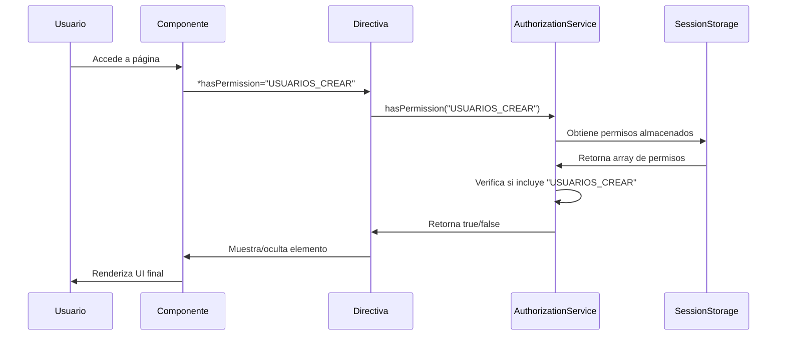

# 🎨 Componentes del Frontend - Angular

## Diagrama de Componentes y Servicios

```mermaid
graph TB
    subgraph "🏠 AppComponent"
        A1[Navegación Principal]
        A2[Botón Login/Logout]
        A3[Estado de Autenticación]
        A4[Menú Dinámico]
    end

    subgraph "🔐 ProtectedDataComponent"
        B1[Botón: Obtener Perfil]
        B2[Botón: Datos Protegidos]
        B3[Botón: Dashboard]
        B4[Botón: Ver Token]
        B5[Visualización de Resultados]
    end

    subgraph "👤 UserPermissionsComponent"
        C1[Información Personal]
        C2[Perfiles Asignados]
        C3[Permisos por Módulo]
        C4[Ejemplos de Renderizado]
        C5[Acciones del Usuario]
    end

    subgraph "🚫 AccessDeniedComponent"
        D1[Página de Error]
        D2[Información del Usuario]
        D3[Opciones de Navegación]
    end

    subgraph "🛡️ Guards"
        E1[PermissionGuard<br/>Verifica permisos específicos]
        E2[AdminGuard<br/>Solo administradores]
        E3[ManagerGuard<br/>Gestores y admins]
    end

    subgraph "📋 Directivas"
        F1[*hasPermission<br/>Renderizado por permiso]
        F2[*isAdmin<br/>Solo administradores]
        F3[*isManager<br/>Gestores y admins]
    end

    subgraph "🔧 Servicios"
        G1[AuthorizationService<br/>Gestión de permisos]
        G2[ApiService<br/>Comunicación HTTP]
        G3[MsalService<br/>Autenticación MSAL]
    end

    subgraph "⚙️ Configuración"
        H1[MSAL Interceptor<br/>Tokens automáticos]
        H2[API Config<br/>URLs y scopes]
        H3[Environment<br/>Configuración por entorno]
    end

    %% Conexiones principales
    A1 --> G1
    A2 --> G3
    A4 --> F1
    A4 --> F2
    A4 --> F3

    B1 --> G2
    B2 --> G2
    B3 --> G2
    B4 --> G3

    C1 --> G1
    C2 --> G1
    C3 --> G1
    C4 --> F1
    C4 --> F2
    C4 --> F3

    %% Guards protegen rutas
    E1 --> G1
    E2 --> G1
    E3 --> G1

    %% Directivas usan servicios
    F1 --> G1
    F2 --> G1
    F3 --> G1

    %% Interceptor agrega tokens
    H1 --> G2
    H1 --> G3

    %% Estilos
    classDef component fill:#1976d2,stroke:#0d47a1,color:#ffffff
    classDef guard fill:#f57c00,stroke:#e65100,color:#ffffff
    classDef directive fill:#7b1fa2,stroke:#4a148c,color:#ffffff
    classDef service fill:#388e3c,stroke:#1b5e20,color:#ffffff
    classDef config fill:#c2185b,stroke:#880e4f,color:#ffffff

    class A1,A2,A3,A4,B1,B2,B3,B4,B5,C1,C2,C3,C4,C5,D1,D2,D3 component
    class E1,E2,E3 guard
    class F1,F2,F3 directive
    class G1,G2,G3 service
    class H1,H2,H3 config
```



## Flujo de Renderizado Condicional



## Ejemplos de Uso de Directivas

### **Directiva `*hasPermission`**
```html
<!-- Permiso específico -->
<button *hasPermission="'USUARIOS_CREAR'" class="btn btn-success">
  <i class="fas fa-plus"></i> Crear Usuario
</button>

<!-- Múltiples permisos (cualquiera) -->
<div *hasPermission="['USUARIOS_LEER', 'USUARIOS_EDITAR']; requireAll: false">
  <p>Lista de usuarios</p>
</div>

<!-- Múltiples permisos (todos) -->
<div *hasPermission="['USUARIOS_LEER', 'USUARIOS_EDITAR']; requireAll: true">
  <p>Panel de gestión avanzada</p>
</div>

<!-- Por módulo -->
<nav *hasPermission="null; module: 'REPORTES'">
  <a href="/reportes">Reportes</a>
</nav>

<!-- Por acción -->
<div *hasPermission="null; action: 'LEER'">
  <p>Contenido de solo lectura</p>
</div>
```

### **Directiva `*isAdmin`**
```html
<div *isAdmin class="admin-panel">
  <h3>Panel de Administración</h3>
  <button class="btn btn-danger">Eliminar Usuario</button>
  <button class="btn btn-warning">Configurar Sistema</button>
</div>
```

### **Directiva `*isManager`**
```html
<div *isManager class="manager-panel">
  <h3>Panel de Gestión</h3>
  <button class="btn btn-primary">Gestionar Usuarios</button>
  <button class="btn btn-info">Ver Reportes</button>
</div>
```

## Guards de Rutas

### **PermissionGuard**
```typescript
{
  path: 'usuarios',
  component: UsuariosComponent,
  canActivate: [PermissionGuard],
  data: { 
    permissions: ['USUARIOS_LEER'],
    requireAll: false
  }
}
```

### **AdminGuard**
```typescript
{
  path: 'admin',
  component: AdminComponent,
  canActivate: [AdminGuard]
}
```

### **ManagerGuard**
```typescript
{
  path: 'gestion',
  component: GestionComponent,
  canActivate: [ManagerGuard]
}
```

## Servicios Principales

### **AuthorizationService**
- `hasPermission(permissionCode)`: Verifica permiso específico
- `hasAnyPermission(permissionCodes)`: Verifica alguno de los permisos
- `hasAllPermissions(permissionCodes)`: Verifica todos los permisos
- `hasModulePermission(module)`: Verifica permisos por módulo
- `getCurrentUserInfo()`: Obtiene información completa del usuario
- `refreshPermissions()`: Actualiza permisos desde el backend

### **ApiService**
- `getUserProfile()`: Obtiene perfil desde Microsoft Graph
- `getProtectedData()`: Obtiene datos de la API Spring Boot
- `getDashboard()`: Obtiene datos del dashboard
- Manejo automático de tokens JWT

### **MsalService**
- `loginRedirect()`: Inicia proceso de login
- `logout()`: Cierra sesión
- `getAllAccounts()`: Obtiene cuentas autenticadas
- `acquireTokenSilent()`: Renueva tokens automáticamente
