# 🚀 Endpoints de la API - Spring Boot

## Diagrama de Endpoints y Controladores

```mermaid
graph TB
    subgraph "🌐 API Base: http://localhost:8080/api"
        A[API Root]
    end

    subgraph "🔓 Endpoints Públicos"
        B1[GET /auth/info<br/>Información de la API]
        B2[GET /actuator/health<br/>Health Check]
        B3[GET /h2-console<br/>Consola de Base de Datos]
    end

    subgraph "🔐 Endpoints de Autenticación"
        C1[GET /auth/user-info<br/>Información del usuario autenticado]
        C2[GET /auth/test<br/>Test de autenticación]
        C3[GET /auth/token-claims<br/>Claims del token JWT]
    end

    subgraph "🛡️ Endpoints de Autorización"
        D1[GET /autorizacion/informacion-usuario<br/>Info completa con permisos]
        D2[GET /autorizacion/permisos<br/>Lista de permisos]
        D3[GET /autorizacion/codigos-permisos<br/>Códigos de permisos]
        D4[GET /autorizacion/tiene-permiso/codigo<br/>Verificar permiso específico]
        D5[POST /autorizacion/verificar-permisos<br/>Verificar múltiples permisos]
        D6[GET /autorizacion/tiene-permiso-modulo/modulo<br/>Permisos por módulo]
        D7[GET /autorizacion/tiene-permiso-accion/accion<br/>Permisos por acción]
        D8[POST /autorizacion/validar-acceso<br/>Validación compleja]
    end

    subgraph "📊 Endpoints de Datos"
        E1[GET /data<br/>Datos protegidos básicos]
        E2[GET /data/dashboard<br/>Datos del dashboard]
        E3[GET /data/proceso-lento<br/>Simulación de proceso lento]
        E4[GET /data/config<br/>Configuración del sistema]
        E5[GET /data/reportes/ventas<br/>Reporte de ventas]
    end

    subgraph "👥 Endpoints de Usuarios"
        F1[GET /users<br/>Lista de usuarios]
        F2[POST /users<br/>Crear usuario]
        F3[GET /users/mi-perfil<br/>Perfil del usuario actual]
        F4[GET /users/estadisticas<br/>Estadísticas de usuarios]
    end

    subgraph "🎭 Endpoints de Perfiles"
        G1[GET /perfiles<br/>Lista de perfiles]
        G2[GET /perfiles/con-permisos<br/>Perfiles con permisos]
        G3[GET /perfiles/id<br/>Perfil por ID]
        G4[GET /perfiles/azure-group/groupId<br/>Perfil por grupo Azure]
        G5[POST /perfiles<br/>Crear perfil]
        G6[PUT /perfiles/id<br/>Actualizar perfil]
        G7[DELETE /perfiles/id<br/>Eliminar perfil]
    end

    subgraph "🔑 Endpoints de Permisos"
        H1[GET /permisos<br/>Lista de permisos]
        H2[GET /permisos/id<br/>Permiso por ID]
        H3[GET /permisos/codigo/codigo<br/>Permiso por código]
        H4[GET /permisos/modulo/modulo<br/>Permisos por módulo]
        H5[GET /permisos/modulos<br/>Lista de módulos]
        H6[POST /permisos<br/>Crear permiso]
        H7[PUT /permisos/id<br/>Actualizar permiso]
    end

    %% Conexiones
    A --> B1
    A --> B2
    A --> B3
    A --> C1
    A --> C2
    A --> C3
    A --> D1
    A --> D2
    A --> D3
    A --> D4
    A --> D5
    A --> D6
    A --> D7
    A --> D8
    A --> E1
    A --> E2
    A --> E3
    A --> E4
    A --> E5
    A --> F1
    A --> F2
    A --> F3
    A --> F4
    A --> G1
    A --> G2
    A --> G3
    A --> G4
    A --> G5
    A --> G6
    A --> G7
    A --> H1
    A --> H2
    A --> H3
    A --> H4
    A --> H5
    A --> H6
    A --> H7

    %% Estilos
    classDef public fill:#388e3c,stroke:#1b5e20,color:#ffffff
    classDef auth fill:#f57c00,stroke:#e65100,color:#ffffff
    classDef authorization fill:#1976d2,stroke:#0d47a1,color:#ffffff
    classDef data fill:#7b1fa2,stroke:#4a148c,color:#ffffff
    classDef users fill:#c2185b,stroke:#880e4f,color:#ffffff
    classDef profiles fill:#388e3c,stroke:#1b5e20,color:#ffffff
    classDef permissions fill:#f57c00,stroke:#e65100,color:#ffffff

    class B1,B2,B3 public
    class C1,C2,C3 auth
    class D1,D2,D3,D4,D5,D6,D7,D8 authorization
    class E1,E2,E3,E4,E5 data
    class F1,F2,F3,F4 users
    class G1,G2,G3,G4,G5,G6,G7 profiles
    class H1,H2,H3,H4,H5,H6,H7 permissions
```



## Flujo de Llamadas a la API


## Ejemplos de Respuestas

### **GET /api/autorizacion/informacion-usuario**
```json
{
  "email": "usuario@empresa.com",
  "nombre": "Juan Pérez",
  "grupos": ["bdff3193-e802-41d9-a5c6-edc6fb0db732"],
  "perfiles": [
    {
      "id": 1,
      "nombre": "Administrador",
      "descripcion": "Acceso completo al sistema",
      "azureGroupId": "bdff3193-e802-41d9-a5c6-edc6fb0db732",
      "azureGroupName": "Administradores Azure"
    }
  ],
  "permisos": [
    {
      "codigo": "USUARIOS_LEER",
      "nombre": "Ver Usuarios",
      "descripcion": "Permite ver la lista de usuarios",
      "modulo": "USUARIOS",
      "accion": "LEER"
    }
  ],
  "codigosPermisos": ["USUARIOS_LEER", "USUARIOS_CREAR", "USUARIOS_EDITAR", "USUARIOS_ELIMINAR"]
}
```

### **GET /api/data**
```json
{
  "mensaje": "Datos protegidos obtenidos exitosamente",
  "usuario": "usuario@empresa.com",
  "timestamp": "2024-01-15T10:30:00Z",
  "datos": {
    "ventas": 15000,
    "usuarios_activos": 25,
    "reportes_generados": 8
  }
}
```

### **GET /api/autorizacion/tiene-permiso/USUARIOS_CREAR**
```json
{
  "tienePermiso": true,
  "permiso": "USUARIOS_CREAR",
  "usuario": "usuario@empresa.com"
}
```

## Códigos de Estado HTTP

| Código | Descripción | Cuándo se usa |
|--------|-------------|---------------|
| **200** | OK | Request exitoso |
| **201** | Created | Recurso creado exitosamente |
| **400** | Bad Request | Datos de entrada inválidos |
| **401** | Unauthorized | Token JWT inválido o expirado |
| **403** | Forbidden | Usuario no tiene permisos |
| **404** | Not Found | Recurso no encontrado |
| **500** | Internal Server Error | Error interno del servidor |

## Headers Requeridos

### **Para Endpoints Protegidos:**
```
Authorization: Bearer <jwt-token>
Content-Type: application/json
```

### **Para Endpoints Públicos:**
```
Content-Type: application/json
```

## Configuración CORS

La API está configurada para aceptar requests desde:
- `http://localhost:4200` (Angular en desarrollo)
- `https://localhost:4200` (Angular con HTTPS)

Métodos permitidos: `GET`, `POST`, `PUT`, `DELETE`, `OPTIONS`
Headers permitidos: `*`
Credentials: `true`
