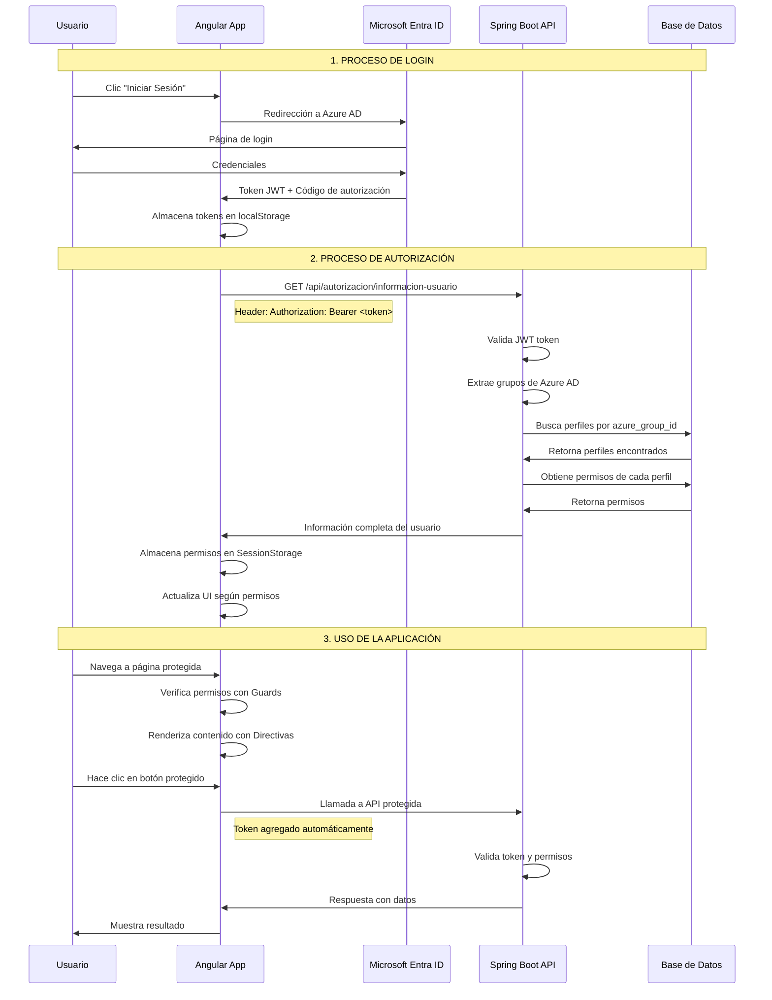

# 🔐 Flujo de Autenticación - Angular + Spring Boot + Azure AD

## Diagrama del Flujo Completo

## Componentes del Flujo

### 🔑 **Autenticación (Login)**
1. **Usuario** hace clic en "Iniciar Sesión"
2. **Angular** redirige a Microsoft Entra ID
3. **Microsoft** autentica al usuario
4. **Microsoft** retorna token JWT con grupos
5. **Angular** almacena tokens automáticamente

### 🛡️ **Autorización (Permisos)**
1. **Angular** solicita información del usuario
2. **Spring Boot** valida token JWT
3. **Spring Boot** extrae grupos de Azure AD
4. **Base de Datos** busca perfiles por grupo
5. **Base de Datos** retorna permisos del perfil
6. **Angular** almacena permisos en SessionStorage

### 🎯 **Uso de la Aplicación**
1. **Guards** protegen rutas según permisos
2. **Directivas** renderizan contenido condicionalmente
3. **Interceptor** agrega tokens automáticamente
4. **APIs** validan permisos en cada request
