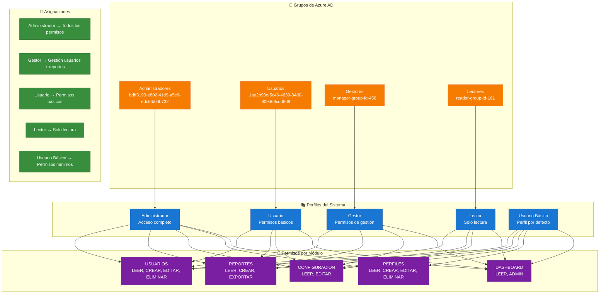
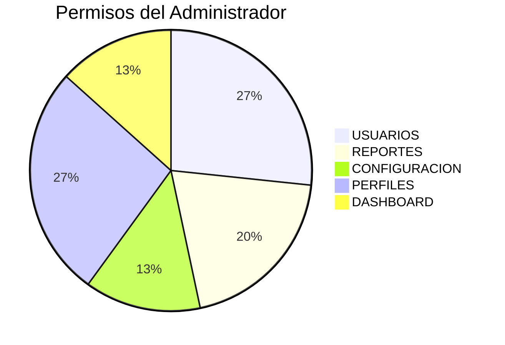
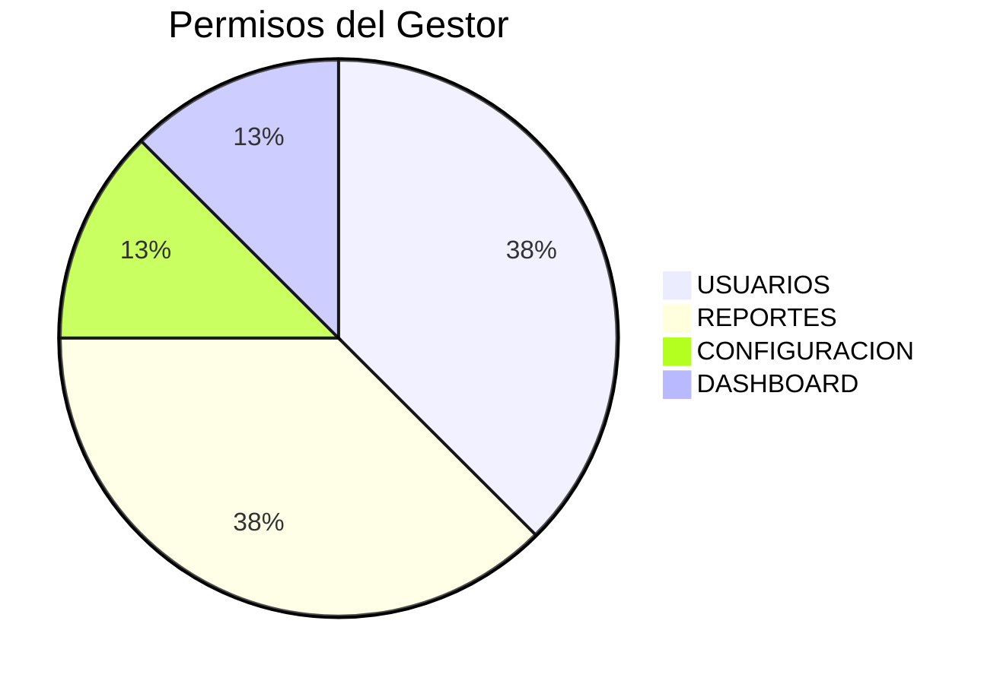
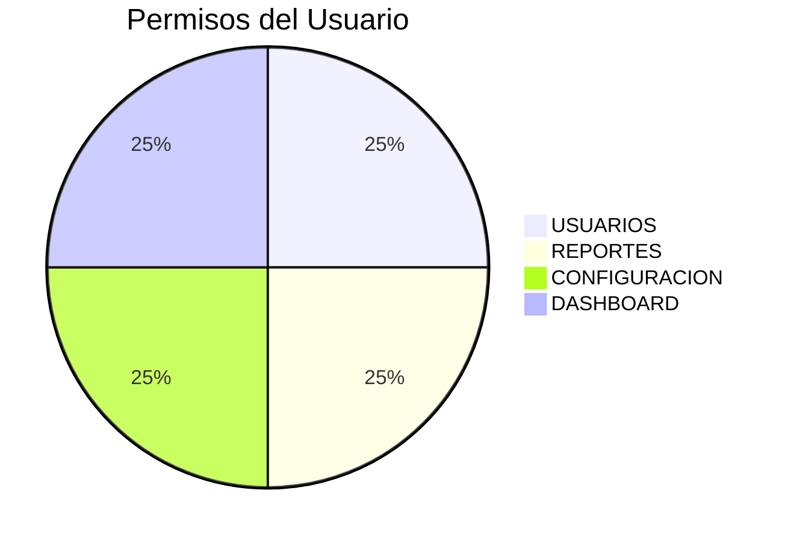
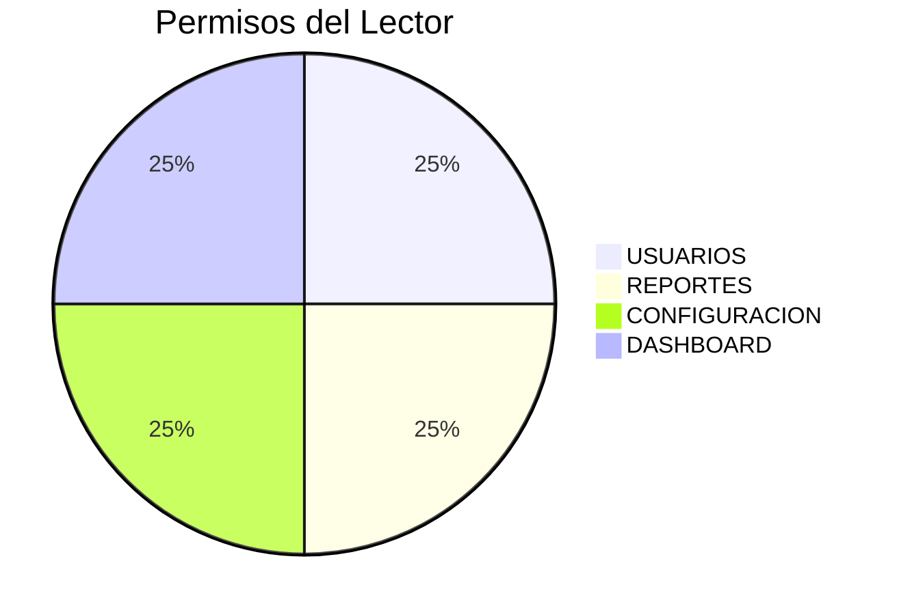
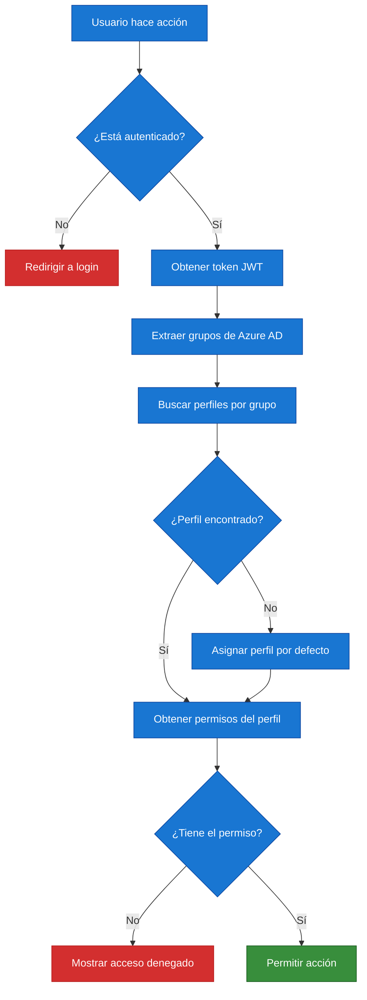

# 🔐 Sistema de Permisos y Roles

## Diagrama del Sistema de Permisos

## Detalle de Permisos por Perfil

### 🔴 **Administrador** (Todos los permisos)

### 🟡 **Gestor** (Permisos de gestión)

### 🟢 **Usuario** (Permisos básicos)

### 🔵 **Lector** (Solo lectura)

## Flujo de Validación de Permisos

## Códigos de Permisos Disponibles

| Módulo | Código | Descripción |
|--------|--------|-------------|
| **USUARIOS** | `USUARIOS_LEER` | Ver lista de usuarios |
| | `USUARIOS_CREAR` | Crear nuevos usuarios |
| | `USUARIOS_EDITAR` | Modificar usuarios |
| | `USUARIOS_ELIMINAR` | Eliminar usuarios |
| **REPORTES** | `REPORTES_LEER` | Ver reportes |
| | `REPORTES_CREAR` | Crear reportes |
| | `REPORTES_EXPORTAR` | Exportar reportes |
| **CONFIGURACION** | `CONFIG_LEER` | Ver configuración |
| | `CONFIG_EDITAR` | Editar configuración |
| **PERFILES** | `PERFILES_LEER` | Ver perfiles |
| | `PERFILES_CREAR` | Crear perfiles |
| | `PERFILES_EDITAR` | Editar perfiles |
| | `PERFILES_ELIMINAR` | Eliminar perfiles |
| **DASHBOARD** | `DASHBOARD_LEER` | Acceso al dashboard |
| | `DASHBOARD_ADMIN` | Dashboard de administrador |
